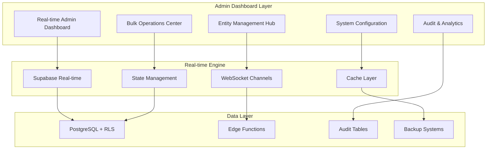

# QCS Cargo - Comprehensive Real-Time Admin Dashboard Architecture

## Executive Summary

This architecture document outlines the design for a comprehensive, real-time admin dashboard system that builds upon the existing QCS Cargo infrastructure. The system will provide complete CRUD operations, real-time synchronization, bulk data management, and advanced administrative controls with full audit logging and rollback capabilities.

## Current System Analysis

### Existing Infrastructure ✅
- **Authentication**: Role-based access control with JWT metadata and database profiles
- **Database**: PostgreSQL with Row Level Security (RLS) policies
- **Admin Components**: Basic dashboard, booking management, shipment tracking, vehicle management, settings
- **Edge Functions**: Server-side operations with admin authentication bypass
- **Real-time**: Limited Supabase real-time subscriptions (auth, bookings, business hours)
- **Audit System**: Basic audit logging infrastructure exists

### Key Database Entities Identified
- Users/Profiles (customers, staff, admin)
- Bookings (with vehicle assignments and geography)
- Shipments (with items and tracking)
- Vehicles (fleet management with capacity optimization)
- Facilities & Virtual Mailboxes
- System Settings (with business hours)
- Notifications & Communications
- Audit Logs & System Health

## Comprehensive Admin Dashboard Architecture

### 1. Real-Time Dashboard Core



### 2. Core System Components

#### A. Enhanced Real-Time Dashboard (`AdminDashboard.tsx`)

**Features:**
- Live KPI updates with WebSocket connections
- Real-time activity feed across all entities
- Dynamic alert system for critical events
- Interactive charts with live data streaming
- Multi-tenant filtering and role-based views

**Technical Implementation:**
```typescript
interface RealtimeDashboard {
  kpis: LiveKPIMetrics
  activityFeed: RealtimeActivityStream
  alerts: SystemAlertManager
  charts: InteractiveLiveCharts
  filters: DynamicFilterSystem
}

// Real-time subscription channels
const DASHBOARD_CHANNELS = [
  'admin_dashboard_kpis',
  'system_activity_feed', 
  'critical_alerts',
  'performance_metrics'
]
```

#### B. Universal Entity Management Hub

**Complete CRUD Operations for:**
- **Users & Profiles**: Create, update, roles, permissions, bulk operations
- **Bookings**: Full lifecycle management, vehicle assignment, status updates
- **Shipments**: Creation, tracking updates, item management, status changes
- **Vehicles**: Fleet management, assignments, maintenance, optimization
- **Virtual Mailboxes**: Assignment, management, facility operations
- **System Settings**: Dynamic configuration, business rules, operational parameters

**Technical Architecture:**
```typescript
interface EntityManager<T> {
  // Real-time CRUD operations
  create: (data: T) => Promise<RealtimeResult<T>>
  read: (filters: EntityFilter) => Promise<PaginatedResult<T>>
  update: (id: string, data: Partial<T>) => Promise<RealtimeResult<T>>
  delete: (ids: string[]) => Promise<BulkOperationResult>
  
  // Bulk operations
  bulkCreate: (items: T[]) => Promise<BulkOperationResult>
  bulkUpdate: (updates: BulkUpdate[]) => Promise<BulkOperationResult>
  bulkDelete: (ids: string[]) => Promise<BulkOperationResult>
  
  // Real-time subscriptions
  subscribe: (callback: RealtimeCallback<T>) => Subscription
  unsubscribe: (subscription: Subscription) => void
}
```

#### C. Advanced Bulk Operations Center

**Capabilities:**
- Multi-select operations across all entities
- Batch processing with progress tracking
- Data import/export (CSV, JSON, Excel)
- Template-based bulk creation
- Validation and error handling
- Rollback capabilities for bulk operations

**Features:**
```typescript
interface BulkOperationsCenter {
  // Selection management
  multiSelectMode: boolean
  selectedItems: Set<string>
  selectionFilters: BulkSelectionFilter[]
  
  // Bulk operations
  bulkEdit: BulkEditOperation
  bulkStatusUpdate: BulkStatusOperation
  bulkDelete: BulkDeleteOperation
  bulkAssignment: BulkAssignmentOperation
  
  // Import/Export
  dataImport: FileImportSystem
  dataExport: FileExportSystem
  templateManager: BulkTemplateManager
  
  // Progress tracking
  operationProgress: BulkOperationProgress
  operationHistory: BulkOperationAudit[]
}
```

### 3. Real-Time Synchronization Architecture

#### A. Comprehensive Real-Time Channels

```typescript
// Global real-time channel configuration
const REALTIME_CHANNELS = {
  // Entity-specific channels
  users: 'postgres_changes:public.user_profiles:*',
  bookings: 'postgres_changes:public.bookings:*',
  shipments: 'postgres_changes:public.shipments:*',
  vehicles: 'postgres_changes:public.vehicles:*',
  facilities: 'postgres_changes:public.facilities:*',
  virtual_mailboxes: 'postgres_changes:public.virtual_mailboxes:*',
  
  // System-wide channels
  settings: 'postgres_changes:public.system_settings:*',
  notifications: 'postgres_changes:public.notifications:*',
  audit_logs: 'postgres_changes:public.audit_logs:*',
  
  // Dashboard-specific channels
  dashboard_metrics: 'admin_dashboard_metrics',
  system_alerts: 'system_alerts',
  bulk_operations: 'bulk_operation_status'
}
```

#### B. State Management with Real-Time Sync

```typescript
interface RealtimeState {
  // Entity states with real-time sync
  entities: {
    [key: string]: {
      data: any[]
      loading: boolean
      error: string | null
      lastUpdated: Date
      subscription: RealtimeSubscription
    }
  }
  
  // Global states
  dashboard: DashboardState
  bulkOperations: BulkOperationState
  systemStatus: SystemStatusState
  
  // Real-time methods
  subscribe: (entity: string, callback: RealtimeCallback) => void
  unsubscribe: (entity: string) => void
  syncState: (entity: string, changes: RealtimeChange) => void
}
```

### 4. Advanced Data Management Tools

#### A. Database Manipulation Interface

**Direct Database Operations:**
```typescript
interface DatabaseManipulation {
  // Raw query execution (admin only)
  executeQuery: (sql: string) => Promise<QueryResult>
  
  // Schema management
  viewSchema: (table: string) => Promise<TableSchema>
  modifySchema: (changes: SchemaChange[]) => Promise<SchemaResult>
  
  // Data integrity
  validateData: (table: string) => Promise<ValidationReport>
  cleanupData: (cleanup: DataCleanupRule[]) => Promise<CleanupResult>
  
  // Performance monitoring
  queryPerformance: (query: string) => Promise<PerformanceMetrics>
  indexAnalysis: (table: string) => Promise<IndexReport>
}
```

#### B. Advanced Search and Filtering

```typescript
interface AdvancedSearch {
  // Global search across all entities
  globalSearch: (term: string, entities?: string[]) => Promise<GlobalSearchResult>
  
  // Advanced filtering
  complexFilters: ComplexFilter[]
  savedFilters: SavedFilter[]
  dynamicFilters: DynamicFilterBuilder
  
  // Search analytics
  searchHistory: SearchHistoryItem[]
  popularSearches: PopularSearch[]
  searchSuggestions: SearchSuggestion[]
}
```

### 5. Comprehensive Audit System & Rollback

#### A. Enhanced Audit Logging

```typescript
interface ComprehensiveAudit {
  // Automatic audit trail for all operations
  autoAudit: {
    create: AuditCreateOperation
    update: AuditUpdateOperation
    delete: AuditDeleteOperation
    bulk: AuditBulkOperation
  }
  
  // Manual audit entries
  manualAudit: {
    addNote: (entityId: string, note: string) => Promise<void>
    flagIssue: (entityId: string, issue: AuditIssue) => Promise<void>
    addAttachment: (auditId: string, file: File) => Promise<void>
  }
  
  // Audit analysis
  auditReports: AuditReport[]
  auditAnalytics: AuditAnalytics
  complianceReports: ComplianceReport[]
}
```

#### B. Rollback System

```typescript
interface RollbackSystem {
  // Point-in-time recovery
  createSnapshot: (entities: string[]) => Promise<SnapshotResult>
  restoreSnapshot: (snapshotId: string) => Promise<RestoreResult>
  
  // Individual rollbacks
  rollbackEntity: (entityId: string, version: number) => Promise<RollbackResult>
  rollbackBulkOperation: (operationId: string) => Promise<BulkRollbackResult>
  
  // Rollback management
  listSnapshots: () => Promise<Snapshot[]>
  scheduleSnapshot: (schedule: SnapshotSchedule) => Promise<void>
  validateRollback: (rollbackId: string) => Promise<ValidationResult>
}
```

### 6. User Role & Permission Management

#### A. Enhanced Role System

```typescript
interface EnhancedRoleSystem {
  // Role management
  roles: AdminRole[]
  permissions: Permission[]
  roleHierarchy: RoleHierarchy
  
  // Permission management
  entityPermissions: EntityPermission[]
  operationPermissions: OperationPermission[]
  bulkOperationPermissions: BulkPermission[]
  
  // Dynamic permissions
  contextualPermissions: ContextualPermission[]
  temporaryPermissions: TemporaryPermission[]
  emergencyAccess: EmergencyAccessSystem
}
```

#### B. Admin User Management

```typescript
interface AdminUserManagement {
  // User CRUD operations
  createUser: (userData: CreateUserRequest) => Promise<UserResult>
  updateUser: (userId: string, updates: UserUpdate) => Promise<UserResult>
  deactivateUser: (userId: string, reason: string) => Promise<void>
  resetPassword: (userId: string) => Promise<PasswordResetResult>
  
  // Role assignment
  assignRole: (userId: string, roleId: string) => Promise<void>
  removeRole: (userId: string, roleId: string) => Promise<void>
  bulkRoleAssignment: (assignments: RoleAssignment[]) => Promise<BulkResult>
  
  // User analytics
  userActivity: UserActivityReport[]
  loginHistory: LoginHistoryItem[]
  permissionUsage: PermissionUsageReport[]
}
```

## Implementation Phases

### Phase 1: Foundation Enhancement (Weeks 1-3)
- Enhance real-time subscription system
- Implement comprehensive state management
- Build entity management infrastructure
- Create audit system foundation

### Phase 2: Core Admin Features (Weeks 4-6)
- Complete CRUD operations for all entities
- Implement bulk operations center
- Build advanced search and filtering
- Create database manipulation tools

### Phase 3: Advanced Features (Weeks 7-9)
- Real-time dashboard enhancements
- Rollback system implementation
- Advanced role and permission management
- Data import/export systems

### Phase 4: Analytics & Optimization (Weeks 10-12)
- Performance monitoring dashboard
- Advanced analytics and reporting
- System optimization tools
- Final testing and deployment

## Technical Requirements

### Frontend Technologies
- **React 18+** with TypeScript
- **Zustand** for state management with real-time sync
- **TanStack Query** for server state management
- **WebSocket API** for real-time communications
- **React Hook Form** for complex form management
- **Recharts/D3** for data visualization

### Backend Infrastructure
- **Supabase Edge Functions** for admin operations
- **PostgreSQL** with enhanced indexing
- **Real-time subscriptions** with channel management
- **Row Level Security** policies
- **Automated backup systems**

### Security Considerations
- **Multi-factor authentication** for admin access
- **Session management** with timeout controls
- **IP restrictions** for admin operations
- **Operation approval workflows** for critical changes
- **Comprehensive audit logging** for compliance

## Performance & Scalability

### Optimizations
- **Database connection pooling**
- **Query optimization** with proper indexing
- **Caching strategies** for frequently accessed data
- **Pagination** for large datasets
- **Lazy loading** for admin interfaces

### Monitoring
- **Real-time performance metrics**
- **Database query analysis**
- **User activity monitoring**
- **System health dashboards**
- **Automated alerting** for critical issues

## Success Metrics

### Operational Efficiency
- 90% reduction in manual admin tasks through bulk operations
- <2 second response times for all admin operations
- Real-time updates propagated within 100ms
- 99.9% uptime for admin systems

### User Experience
- <3 clicks to access any admin function
- Context-aware help and documentation
- Intuitive bulk operation workflows
- Comprehensive search and filtering capabilities

### Data Integrity & Security
- 100% audit trail coverage for all operations
- Zero data loss with rollback capabilities
- Role-based access control compliance
- Automated compliance reporting

This architecture provides a comprehensive foundation for a world-class admin dashboard system that scales with the QCS Cargo business while maintaining security, performance, and usability standards.