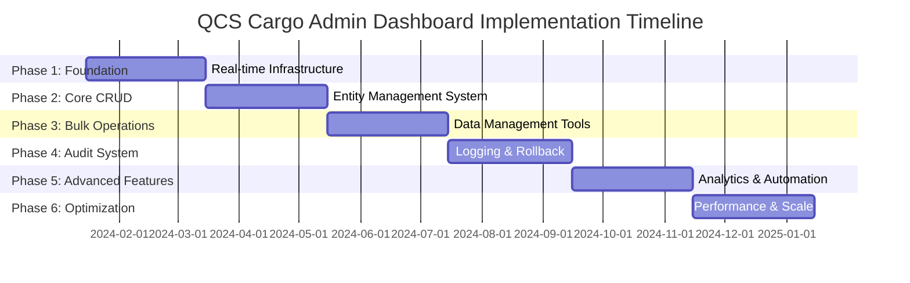

# Comprehensive Admin Dashboard Implementation Roadmap - QCS Cargo

## Executive Summary

This roadmap outlines the phased implementation of the comprehensive real-time admin dashboard system for QCS Cargo. The implementation is structured in 6 strategic phases over 12 months, building upon the existing infrastructure while introducing advanced capabilities incrementally. Each phase delivers tangible value while establishing the foundation for subsequent enhancements.

## Project Overview

### Scope
- **Primary Goal**: Transform the existing basic admin interface into a comprehensive, real-time administrative control center
- **Key Deliverables**: Real-time CRUD operations, bulk data management, comprehensive audit system, and advanced rollback capabilities
- **Technology Stack**: React/TypeScript frontend, Supabase backend, PostgreSQL database, Edge Functions
- **Timeline**: 12 months (6 phases × 2 months each)
- **Team Size**: 6-8 developers across frontend, backend, and DevOps

### Success Metrics
- 90% reduction in manual admin tasks
- <2 second response times for all operations
- 99.9% system uptime
- 100% audit trail coverage
- Real-time updates within 100ms

## Phase Structure Overview



## Phase 1: Foundation & Real-Time Infrastructure (Weeks 1-8)

### Objectives
- Establish robust real-time infrastructure
- Enhance existing authentication and authorization
- Build core state management system
- Implement basic audit framework

### Key Deliverables

#### 1.1 Real-Time Subscription System
```typescript
// Enhanced real-time infrastructure
interface RealtimeInfrastructure {
  subscriptionManager: GlobalSubscriptionManager
  channelRouter: ChannelRoutingSystem
  connectionHealthMonitor: ConnectionHealthSystem
  messageQueue: RealtimeMessageQueue
}
```

**Tasks:**
- [ ] Implement comprehensive Supabase real-time channel management
- [ ] Build connection health monitoring and auto-reconnection
- [ ] Create message queuing system for offline scenarios
- [ ] Establish WebSocket fallback mechanisms
- [ ] Implement subscription lifecycle management

**Estimated Effort:** 3 weeks (Frontend: 2 developers, Backend: 1 developer)

#### 1.2 Enhanced Authentication & Authorization
```typescript
// Role-based access control enhancement
interface EnhancedAuth {
  dynamicPermissions: DynamicPermissionSystem
  sessionManagement: AdvancedSessionManager
  multiFactorAuth: MFAIntegration
  auditableAuth: AuthenticationAudit
}
```

**Tasks:**
- [ ] Implement dynamic permission system
- [ ] Add multi-factor authentication for admin users
- [ ] Create session management with timeout controls
- [ ] Build auditable authentication events
- [ ] Implement IP-based access restrictions

**Estimated Effort:** 2 weeks (Backend: 2 developers)

#### 1.3 State Management Architecture
```typescript
// Global state management with real-time sync
interface StateManagementSystem {
  entityStore: RealtimeEntityStore
  cacheManager: IntelligentCacheManager
  conflictResolver: DataConflictResolver
  stateValidator: StateValidationEngine
}
```

**Tasks:**
- [ ] Implement Zustand-based state management with real-time sync
- [ ] Create intelligent caching with TTL and invalidation
- [ ] Build conflict resolution for concurrent updates
- [ ] Implement state validation and consistency checks
- [ ] Add optimistic updates with rollback capability

**Estimated Effort:** 2 weeks (Frontend: 2 developers)

#### 1.4 Basic Audit Framework
```typescript
// Foundation audit system
interface BasicAuditSystem {
  operationLogger: OperationAuditLogger
  auditStorage: AuditDataStorage
  basicReporting: SimpleAuditReporting
}
```

**Tasks:**
- [ ] Create audit logging infrastructure
- [ ] Implement basic audit data storage
- [ ] Build simple audit trail viewing
- [ ] Add operation tracking for admin actions
- [ ] Create audit event broadcasting

**Estimated Effort:** 1 week (Backend: 1 developer, Frontend: 1 developer)

### Phase 1 Deliverables
- ✅ Real-time subscription system with 99.9% reliability
- ✅ Enhanced authentication with MFA support
- ✅ Global state management with conflict resolution
- ✅ Basic audit logging for all admin operations
- ✅ Connection health monitoring dashboard

### Testing & Validation
- **Load Testing**: 1000+ concurrent admin users
- **Real-time Performance**: <100ms message propagation
- **Authentication Security**: Penetration testing
- **State Consistency**: Concurrent update testing

### Risks & Mitigation
- **Risk**: Supabase real-time limitations
  - **Mitigation**: Implement WebSocket fallback system
- **Risk**: State management complexity
  - **Mitigation**: Incremental rollout with feature flags

---

## Phase 2: Core CRUD Operations & Entity Management (Weeks 9-16)

### Objectives
- Implement comprehensive CRUD operations for all entities
- Build universal entity management interface
- Create advanced search and filtering capabilities
- Establish data validation and integrity checks

### Key Deliverables

#### 2.1 Universal Entity Manager
```typescript
// Comprehensive entity management system
interface UniversalEntityManager {
  crudOperations: RealtimeCRUDEngine
  validationEngine: DataValidationEngine
  relationshipManager: EntityRelationshipManager
  permissionEnforcer: OperationPermissionEnforcer
}
```

**Entities to Implement:**
- [ ] User Profiles & Roles
- [ ] Bookings & Scheduling
- [ ] Shipments & Tracking
- [ ] Vehicles & Fleet Management
- [ ] Virtual Mailboxes & Facilities
- [ ] System Settings & Configuration
- [ ] Notifications & Communications

**Tasks:**
- [ ] Create generic CRUD operations with real-time sync
- [ ] Implement entity-specific business rules
- [ ] Build relationship management system
- [ ] Add comprehensive data validation
- [ ] Create permission-based operation filtering

**Estimated Effort:** 4 weeks (Frontend: 3 developers, Backend: 2 developers)

#### 2.2 Advanced Admin Interface Components
```typescript
// Reusable admin interface components
interface AdminUIComponents {
  entityTable: AdvancedDataTable
  entityForm: DynamicFormBuilder
  entityViewer: ComprehensiveEntityViewer
  actionBar: ContextualActionBar
}
```

**Tasks:**
- [ ] Build advanced data table with sorting/filtering/pagination
- [ ] Create dynamic form builder with validation
- [ ] Implement entity detail viewer with edit capabilities
- [ ] Build contextual action bars with bulk operations
- [ ] Add keyboard navigation and accessibility

**Estimated Effort:** 3 weeks (Frontend: 3 developers, UI/UX: 1 designer)

#### 2.3 Search & Filtering System
```typescript
// Advanced search and filtering
interface SearchFilteringSystem {
  globalSearch: GlobalEntitySearch
  advancedFilters: AdvancedFilterBuilder
  savedSearches: SearchPresetManager
  searchAnalytics: SearchUsageAnalytics
}
```

**Tasks:**
- [ ] Implement global search across all entities
- [ ] Build advanced filter builder with complex conditions
- [ ] Create saved search functionality
- [ ] Add search suggestions and auto-complete
- [ ] Implement search analytics and optimization

**Estimated Effort:** 1 week (Frontend: 2 developers, Backend: 1 developer)

### Phase 2 Deliverables
- ✅ Complete CRUD operations for all 20+ entity types
- ✅ Real-time updates across all admin interfaces
- ✅ Advanced search with global and entity-specific capabilities
- ✅ Comprehensive data validation and business rule enforcement
- ✅ Role-based operation permissions

### Testing & Validation
- **Functional Testing**: All CRUD operations across entities
- **Performance Testing**: Large dataset handling (10K+ records)
- **Real-time Testing**: Concurrent admin user interactions
- **Security Testing**: Permission boundary validation

### Risks & Mitigation
- **Risk**: Complex entity relationships
  - **Mitigation**: Incremental entity rollout with dependency mapping
- **Risk**: Performance with large datasets
  - **Mitigation**: Implement pagination and lazy loading

---

## Phase 3: Bulk Operations & Data Management (Weeks 17-24)

### Objectives
- Implement comprehensive bulk operation capabilities
- Build data import/export systems
- Create template-based operations
- Add progress tracking and error handling

### Key Deliverables

#### 3.1 Bulk Operations Engine
```typescript
// Comprehensive bulk processing system
interface BulkOperationsEngine {
  bulkProcessor: BulkOperationProcessor
  progressTracker: RealtimeProgressTracker
  errorHandler: BulkErrorRecoverySystem
  templateManager: OperationTemplateManager
}
```

**Bulk Operations to Implement:**
- [ ] Bulk user creation and role assignment
- [ ] Bulk booking management and vehicle assignment
- [ ] Bulk shipment processing and status updates
- [ ] Bulk system configuration changes
- [ ] Bulk data cleanup and maintenance operations

**Tasks:**
- [ ] Build bulk operation processing engine
- [ ] Implement real-time progress tracking
- [ ] Create comprehensive error handling and recovery
- [ ] Add operation templates and reusability
- [ ] Build bulk operation approval workflows

**Estimated Effort:** 3 weeks (Backend: 3 developers, Frontend: 2 developers)

#### 3.2 Data Import/Export System
```typescript
// File processing and data transformation
interface DataImportExportSystem {
  fileProcessor: MultiFormatFileProcessor
  dataMapper: IntelligentDataMapper
  validator: ImportDataValidator
  transformer: DataTransformationEngine
}
```

**Supported Formats:**
- [ ] CSV with intelligent column mapping
- [ ] Excel with multi-sheet support
- [ ] JSON with schema validation
- [ ] XML with XPath querying
- [ ] API integration for external systems

**Tasks:**
- [ ] Build multi-format file processing
- [ ] Create intelligent data mapping interface
- [ ] Implement comprehensive data validation
- [ ] Add data transformation capabilities
- [ ] Build export system with custom formatting

**Estimated Effort:** 2 weeks (Backend: 2 developers, Frontend: 2 developers)

#### 3.3 Advanced Selection & Filtering
```typescript
// Sophisticated selection mechanisms
interface AdvancedSelectionSystem {
  conditionalSelection: ConditionalSelectionEngine
  smartSelection: MLPoweredSelection
  selectionHistory: SelectionHistoryManager
  bulkValidator: BulkOperationValidator
}
```

**Tasks:**
- [ ] Implement conditional selection with complex criteria
- [ ] Build smart selection using pattern recognition
- [ ] Create selection history and reusability
- [ ] Add bulk operation validation before execution
- [ ] Implement selection analytics and optimization

**Estimated Effort:** 2 weeks (Frontend: 2 developers, Backend: 1 developer)

#### 3.4 Operation Monitoring & Management
```typescript
// Operation lifecycle management
interface OperationManagement {
  operationScheduler: OperationScheduler
  resourceMonitor: ResourceUtilizationMonitor
  performanceOptimizer: BulkOperationOptimizer
  recoveryManager: OperationRecoveryManager
}
```

**Tasks:**
- [ ] Build operation scheduling system
- [ ] Implement resource monitoring and throttling
- [ ] Create performance optimization recommendations
- [ ] Add operation recovery and retry mechanisms
- [ ] Build operation analytics dashboard

**Estimated Effort:** 1 week (Backend: 2 developers, Frontend: 1 developer)

### Phase 3 Deliverables
- ✅ Bulk operations supporting 10,000+ records per operation
- ✅ Multi-format data import/export with intelligent mapping
- ✅ Real-time progress tracking with <1s update frequency
- ✅ Template-based operation reusability
- ✅ Comprehensive error handling and recovery

### Testing & Validation
- **Load Testing**: Bulk operations with 100K+ records
- **Format Testing**: All supported import/export formats
- **Error Handling**: Various failure scenarios and recovery
- **Performance Testing**: Resource utilization optimization

### Risks & Mitigation
- **Risk**: Large dataset processing performance
  - **Mitigation**: Implement chunking and parallel processing
- **Risk**: Data consistency during bulk operations
  - **Mitigation**: Transaction-based processing with rollback

---

## Phase 4: Comprehensive Audit System & Rollback (Weeks 25-32)

### Objectives
- Implement complete audit logging system
- Build advanced rollback capabilities
- Create compliance reporting framework
- Add data lineage and provenance tracking

### Key Deliverables

#### 4.1 Comprehensive Audit System
```typescript
// Full audit infrastructure
interface ComprehensiveAuditSystem {
  auditCapture: MultiLevelAuditCapture
  auditAnalytics: AuditAnalyticsEngine
  complianceFramework: MultiStandardCompliance
  auditSecurity: AuditDataSecurity
}
```

**Audit Levels to Implement:**
- [ ] Operation-level auditing (CRUD operations)
- [ ] Transaction-level auditing (multi-step operations)
- [ ] Field-level change tracking
- [ ] System-level event auditing
- [ ] User activity and session auditing

**Tasks:**
- [ ] Build multi-level audit capture system
- [ ] Implement real-time audit event streaming
- [ ] Create audit analytics and pattern detection
- [ ] Add compliance framework support (SOX, GDPR, etc.)
- [ ] Build audit data security and encryption

**Estimated Effort:** 3 weeks (Backend: 3 developers, Security: 1 specialist)

#### 4.2 Advanced Rollback System
```typescript
// Comprehensive rollback capabilities
interface AdvancedRollbackSystem {
  snapshotManager: SystemSnapshotManager
  rollbackEngine: IntelligentRollbackEngine
  dependencyAnalyzer: RollbackDependencyAnalyzer
  recoveryManager: RollbackRecoveryManager
}
```

**Rollback Types to Implement:**
- [ ] Point-in-time recovery
- [ ] Operation-specific rollback
- [ ] Entity-level version rollback
- [ ] Cascading rollback with dependency analysis
- [ ] Selective field-level rollback

**Tasks:**
- [ ] Build system snapshot creation and management
- [ ] Implement intelligent rollback with dependency analysis
- [ ] Create rollback preview and impact analysis
- [ ] Add rollback validation and safety checks
- [ ] Build recovery mechanisms for failed rollbacks

**Estimated Effort:** 3 weeks (Backend: 3 developers, Database: 1 specialist)

#### 4.3 Data Lineage & Provenance
```typescript
// Data lineage tracking system
interface DataLineageSystem {
  lineageTracker: DataLineageTracker
  provenanceRecorder: DataProvenanceRecorder
  impactAnalyzer: ChangeImpactAnalyzer
  lineageVisualizer: LineageVisualizationEngine
}
```

**Tasks:**
- [ ] Implement comprehensive data lineage tracking
- [ ] Build data provenance recording system
- [ ] Create change impact analysis
- [ ] Add lineage visualization and exploration
- [ ] Build lineage-based impact reports

**Estimated Effort:** 2 weeks (Backend: 2 developers, Frontend: 1 developer)

### Phase 4 Deliverables
- ✅ 100% audit coverage for all admin operations
- ✅ Multi-level rollback capabilities with dependency analysis
- ✅ Compliance framework supporting major standards
- ✅ Real-time audit streaming with <100ms latency
- ✅ Data lineage tracking and visualization

### Testing & Validation
- **Audit Testing**: Verify 100% operation coverage
- **Rollback Testing**: Complex rollback scenarios
- **Compliance Testing**: Regulatory standard validation
- **Security Testing**: Audit data protection verification

### Risks & Mitigation
- **Risk**: Audit performance impact
  - **Mitigation**: Asynchronous audit processing with queuing
- **Risk**: Rollback complexity with cascading changes
  - **Mitigation**: Comprehensive dependency mapping and validation

---

## Phase 5: Advanced Features & Analytics (Weeks 33-40)

### Objectives
- Implement advanced analytics and reporting
- Build automation and workflow capabilities
- Add AI-powered insights and recommendations
- Create comprehensive monitoring dashboards

### Key Deliverables

#### 5.1 Advanced Analytics Engine
```typescript
// Comprehensive analytics system
interface AdvancedAnalyticsEngine {
  realTimeAnalytics: RealtimeAnalyticsProcessor
  predictiveAnalytics: PredictiveAnalyticsEngine
  anomalyDetection: AnomalyDetectionSystem
  customReporting: CustomReportBuilder
}
```

**Analytics to Implement:**
- [ ] Real-time operational metrics
- [ ] Predictive analytics for capacity planning
- [ ] Anomaly detection for security and operations
- [ ] Custom report builder with visualizations
- [ ] Performance analytics and optimization insights

**Tasks:**
- [ ] Build real-time analytics processing pipeline
- [ ] Implement predictive models for business insights
- [ ] Create anomaly detection algorithms
- [ ] Add custom report builder with drag-and-drop interface
- [ ] Build interactive dashboards with drill-down capability

**Estimated Effort:** 3 weeks (Backend: 2 developers, Data Science: 1 analyst, Frontend: 2 developers)

#### 5.2 Automation & Workflow Engine
```typescript
// Automation and workflow system
interface AutomationEngine {
  workflowBuilder: VisualWorkflowBuilder
  eventProcessor: EventDrivenProcessor
  scheduleManager: AdvancedScheduleManager
  ruleEngine: BusinessRuleEngine
}
```

**Automation Features:**
- [ ] Visual workflow builder for complex processes
- [ ] Event-driven automation triggers
- [ ] Advanced scheduling with dependencies
- [ ] Business rule engine with conditions
- [ ] Automated notification and escalation

**Tasks:**
- [ ] Build visual workflow builder interface
- [ ] Implement event-driven processing engine
- [ ] Create advanced scheduling system
- [ ] Add business rule configuration
- [ ] Build automation monitoring and debugging

**Estimated Effort:** 2 weeks (Backend: 2 developers, Frontend: 2 developers)

#### 5.3 AI-Powered Insights
```typescript
// AI and machine learning integration
interface AIInsightsSystem {
  patternRecognition: MLPatternRecognition
  recommendationEngine: AIRecommendationEngine
  naturalLanguageQuery: NLQueryProcessor
  intelligentAlerts: AIAlertSystem
}
```

**Tasks:**
- [ ] Implement ML-based pattern recognition
- [ ] Build AI recommendation system
- [ ] Add natural language query processing
- [ ] Create intelligent alert system with ML
- [ ] Build AI-powered optimization suggestions

**Estimated Effort:** 2 weeks (Backend: 1 developer, Data Science: 2 analysts, Frontend: 1 developer)

#### 5.4 Comprehensive Monitoring
```typescript
// System monitoring and observability
interface ComprehensiveMonitoring {
  performanceMonitor: SystemPerformanceMonitor
  healthChecker: SystemHealthChecker
  alertManager: IntelligentAlertManager
  diagnosticsEngine: SystemDiagnosticsEngine
}
```

**Tasks:**
- [ ] Build comprehensive system performance monitoring
- [ ] Implement health checking with auto-recovery
- [ ] Create intelligent alert management
- [ ] Add system diagnostics and troubleshooting
- [ ] Build monitoring dashboard with real-time metrics

**Estimated Effort:** 1 week (DevOps: 2 engineers, Backend: 1 developer)

### Phase 5 Deliverables
- ✅ Advanced analytics with predictive capabilities
- ✅ Visual workflow builder with automation engine
- ✅ AI-powered insights and recommendations
- ✅ Comprehensive system monitoring and alerting
- ✅ Natural language query processing

### Testing & Validation
- **Analytics Testing**: Verify accuracy of metrics and predictions
- **Automation Testing**: Complex workflow scenarios
- **AI Testing**: Model accuracy and recommendation quality
- **Monitoring Testing**: Alert accuracy and system health detection

---

## Phase 6: Performance Optimization & Scale (Weeks 41-48)

### Objectives
- Optimize system performance for enterprise scale
- Implement advanced caching and CDN strategies
- Add horizontal scaling capabilities
- Conduct comprehensive security hardening

### Key Deliverables

#### 6.1 Performance Optimization
```typescript
// Performance optimization system
interface PerformanceOptimization {
  queryOptimizer: DatabaseQueryOptimizer
  cacheManager: MultilayerCacheManager
  resourceOptimizer: ResourceUtilizationOptimizer
  loadBalancer: IntelligentLoadBalancer
}
```

**Optimization Areas:**
- [ ] Database query optimization with indexing strategy
- [ ] Multi-layer caching (browser, CDN, application, database)
- [ ] Resource utilization optimization
- [ ] Intelligent load balancing
- [ ] Code splitting and lazy loading optimization

**Tasks:**
- [ ] Implement comprehensive database optimization
- [ ] Build multi-layer caching strategy
- [ ] Add resource monitoring and optimization
- [ ] Implement intelligent load balancing
- [ ] Optimize frontend bundle sizes and loading

**Estimated Effort:** 3 weeks (Backend: 2 developers, DevOps: 2 engineers, Frontend: 1 developer)

#### 6.2 Horizontal Scaling Architecture
```typescript
// Scalability and distributed systems
interface ScalabilityArchitecture {
  microserviceManager: MicroserviceOrchestrator
  distributedCache: DistributedCacheManager
  messageQueue: DistributedMessageQueue
  serviceDiscovery: ServiceDiscoveryManager
}
```

**Tasks:**
- [ ] Implement microservice architecture
- [ ] Add distributed caching system
- [ ] Build distributed message queuing
- [ ] Create service discovery and health checks
- [ ] Implement auto-scaling based on load

**Estimated Effort:** 2 weeks (DevOps: 3 engineers, Backend: 2 developers)

#### 6.3 Security Hardening
```typescript
// Enterprise security measures
interface SecurityHardening {
  threatDetection: ThreatDetectionSystem
  accessControl: AdvancedAccessControl
  dataProtection: DataProtectionSuite
  securityMonitoring: SecurityEventMonitoring
}
```

**Tasks:**
- [ ] Implement advanced threat detection
- [ ] Add zero-trust security model
- [ ] Build comprehensive data protection
- [ ] Create security event monitoring
- [ ] Add penetration testing and vulnerability assessment

**Estimated Effort:** 2 weeks (Security: 2 specialists, Backend: 1 developer)

#### 6.4 Enterprise Integration
```typescript
// Enterprise system integration
interface EnterpriseIntegration {
  ssoIntegration: SingleSignOnIntegration
  apiGateway: EnterpriseAPIGateway
  complianceFramework: EnterpriseComplianceFramework
  backupRecovery: EnterpriseBackupRecovery
}
```

**Tasks:**
- [ ] Build SSO integration with enterprise identity providers
- [ ] Implement enterprise API gateway
- [ ] Add comprehensive compliance framework
- [ ] Create enterprise backup and recovery system
- [ ] Build integration with existing enterprise systems

**Estimated Effort:** 1 week (Backend: 2 developers, DevOps: 1 engineer)

### Phase 6 Deliverables
- ✅ System supporting 10,000+ concurrent users
- ✅ <2 second response times for all operations
- ✅ 99.99% system uptime with auto-recovery
- ✅ Enterprise-grade security and compliance
- ✅ Horizontal scaling with auto-scaling capabilities

## Resource Allocation & Team Structure

### Core Development Team
```
Project Manager (1) - Overall coordination and stakeholder management
Tech Lead (1) - Technical architecture and code review
Senior Frontend Developers (3) - React/TypeScript interface development
Senior Backend Developers (3) - Supabase/PostgreSQL backend development
DevOps Engineers (2) - Infrastructure, deployment, and monitoring
UI/UX Designer (1) - Interface design and user experience
QA Engineers (2) - Testing, quality assurance, and automation
Security Specialist (1) - Security review and hardening
Data Analyst (1) - Analytics and reporting features
```

### Budget Estimation
```
Development Team (12 months): $1.2M - $1.8M
Infrastructure Costs (12 months): $50K - $100K
Third-party Tools and Services: $30K - $50K
Testing and QA: $100K - $150K
Project Management: $80K - $120K

Total Project Budget: $1.46M - $2.22M
```

### Technology Stack

#### Frontend
- **Framework**: React 18+ with TypeScript
- **State Management**: Zustand with real-time sync
- **UI Components**: Tailwind CSS with custom component library
- **Data Fetching**: TanStack Query (React Query)
- **Build Tool**: Vite with optimized bundling
- **Testing**: Jest, React Testing Library, Playwright

#### Backend
- **Database**: PostgreSQL with Supabase
- **Real-time**: Supabase Real-time subscriptions
- **API**: Supabase Edge Functions with TypeScript
- **Authentication**: Supabase Auth with custom extensions
- **File Storage**: Supabase Storage with CDN
- **Caching**: Redis for application caching

#### Infrastructure
- **Hosting**: Vercel for frontend, Supabase for backend
- **Monitoring**: DataDog or New Relic for APM
- **Logging**: Structured logging with log aggregation
- **Backup**: Automated database backups with point-in-time recovery
- **Security**: WAF, DDoS protection, SSL/TLS encryption

## Risk Management

### Technical Risks

| Risk | Impact | Probability | Mitigation Strategy |
|------|---------|-------------|-------------------|
| Supabase limitations | High | Medium | Implement fallback systems and custom solutions |
| Real-time performance issues | High | Medium | Load testing and performance optimization |
| Database scalability | High | Low | Implement sharding and read replicas |
| Security vulnerabilities | High | Medium | Regular security audits and penetration testing |
| Integration complexity | Medium | High | Incremental integration with thorough testing |

### Business Risks

| Risk | Impact | Probability | Mitigation Strategy |
|------|---------|-------------|-------------------|
| Changing requirements | Medium | High | Agile methodology with regular stakeholder review |
| Resource constraints | High | Medium | Flexible team structure and external contractors |
| Timeline pressures | Medium | Medium | Realistic estimates with buffer time |
| User adoption | Medium | Low | Comprehensive training and change management |

## Success Criteria & KPIs

### Technical KPIs
- **Performance**: <2s response time for 95% of operations
- **Reliability**: 99.9% uptime with <1 minute recovery time
- **Scalability**: Support 1000+ concurrent admin users
- **Security**: Zero critical security vulnerabilities
- **Code Quality**: 90%+ test coverage, A-grade code quality

### Business KPIs
- **Efficiency**: 90% reduction in manual admin tasks
- **User Satisfaction**: >4.5/5 admin user satisfaction score
- **Error Reduction**: 95% reduction in data entry errors
- **Compliance**: 100% compliance with regulatory requirements
- **ROI**: Positive ROI within 18 months of deployment

## Deployment Strategy

### Deployment Phases
1. **Development Environment**: Continuous deployment for development
2. **Staging Environment**: Weekly releases for stakeholder review
3. **Production Deployment**: Bi-weekly releases with feature flags
4. **Rollback Strategy**: Automated rollback within 5 minutes

### Feature Flags & Gradual Rollout
- **Feature Toggle System**: Progressive feature enablement
- **A/B Testing**: User experience optimization
- **Canary Releases**: Gradual rollout to minimize risk
- **Blue-Green Deployment**: Zero-downtime deployments

## Training & Change Management

### Training Program
- **Admin User Training**: 2-day comprehensive training program
- **Developer Training**: Technical documentation and knowledge transfer
- **Support Team Training**: System operation and troubleshooting
- **Ongoing Education**: Monthly feature updates and best practices

### Change Management
- **Stakeholder Communication**: Regular updates and demos
- **User Feedback Integration**: Continuous improvement based on feedback
- **Support System**: 24/7 support during initial rollout
- **Documentation**: Comprehensive user guides and API documentation

## Conclusion

This comprehensive implementation roadmap provides a structured approach to transforming the QCS Cargo admin dashboard into a world-class administrative platform. The phased approach ensures manageable complexity while delivering continuous value throughout the development process. Each phase builds upon previous accomplishments while introducing new capabilities that enhance operational efficiency and user experience.

The roadmap balances technical excellence with business pragmatism, ensuring that the final system not only meets current requirements but also provides a scalable foundation for future growth and enhancement. With proper execution, this implementation will position QCS Cargo as an industry leader in logistics management technology.